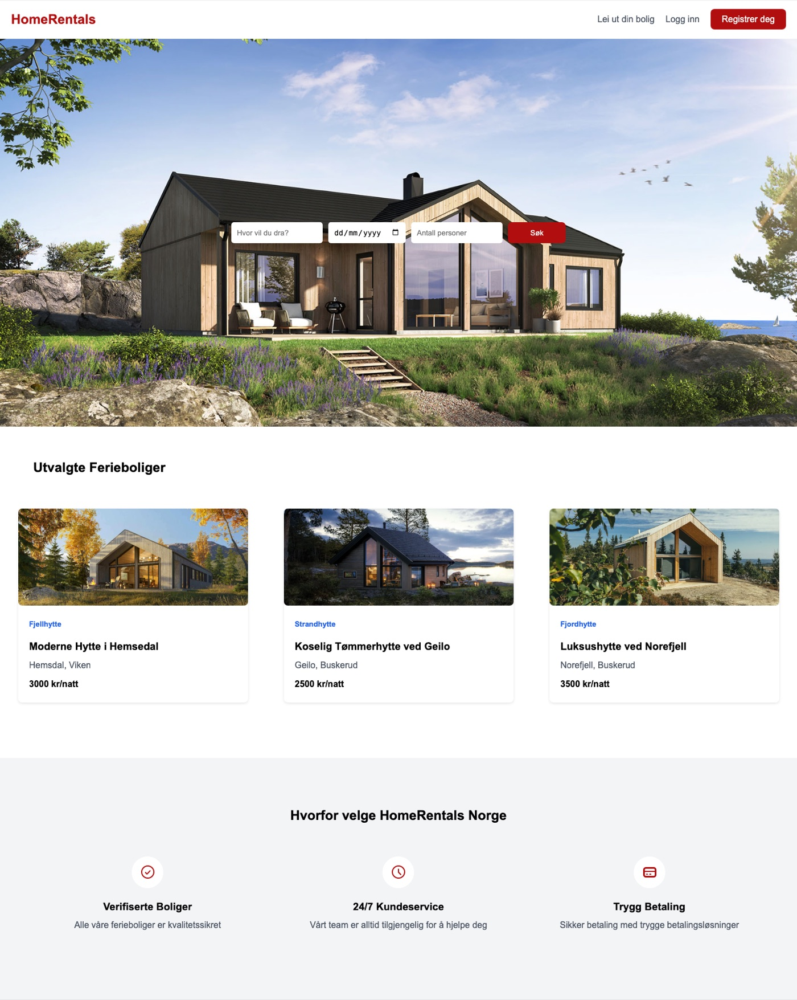
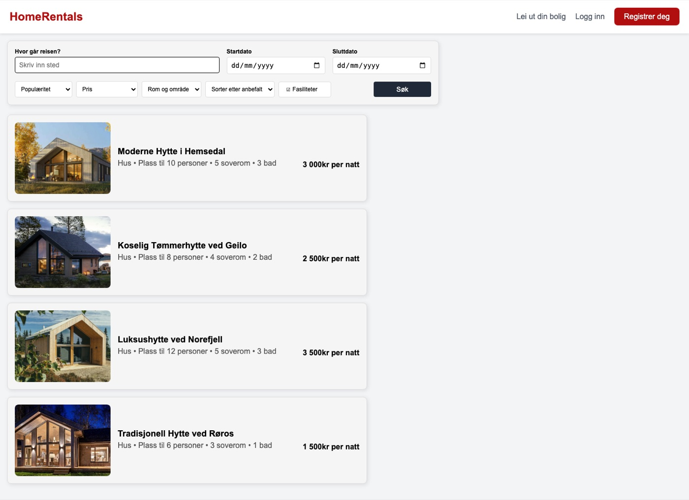
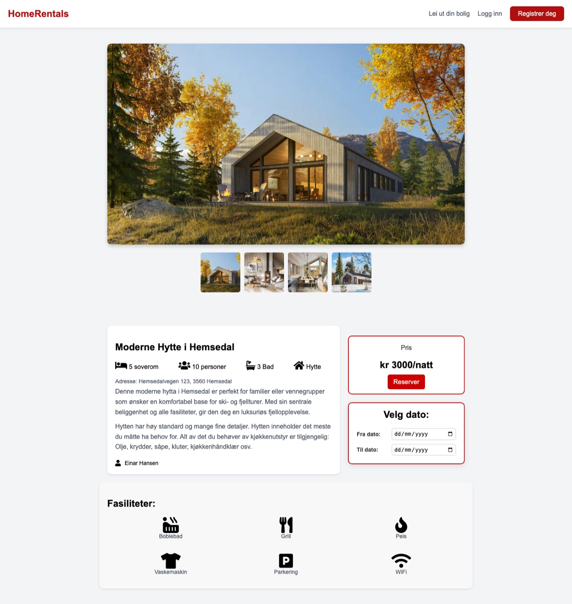
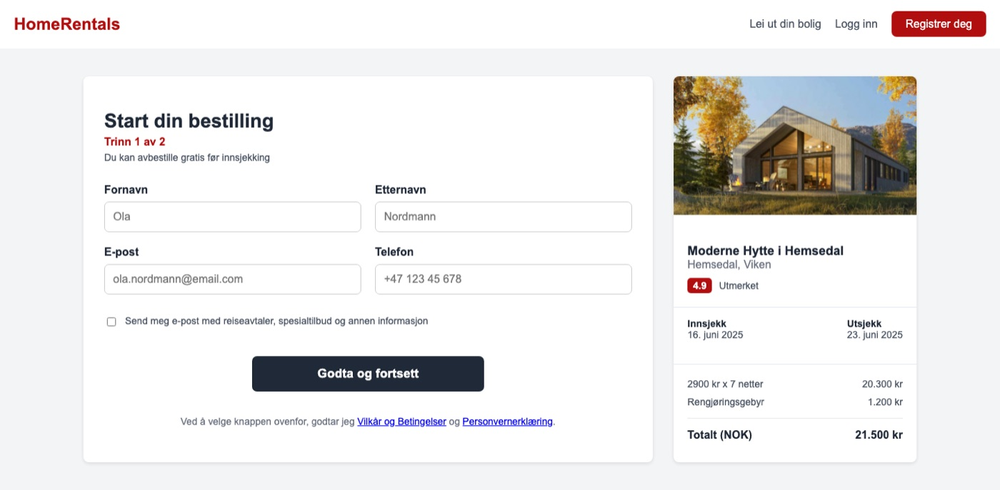
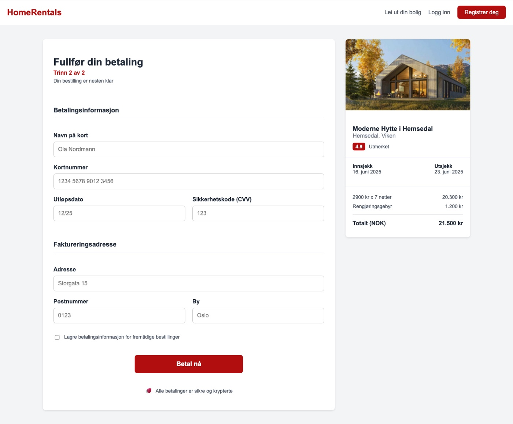
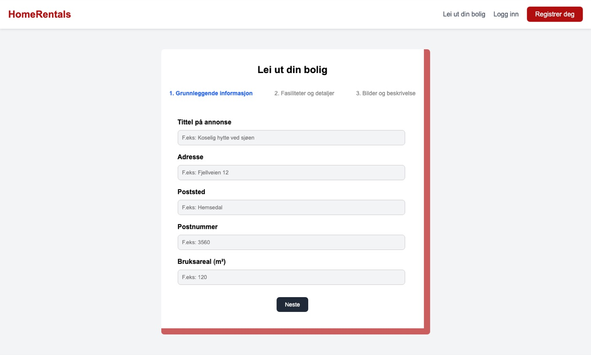
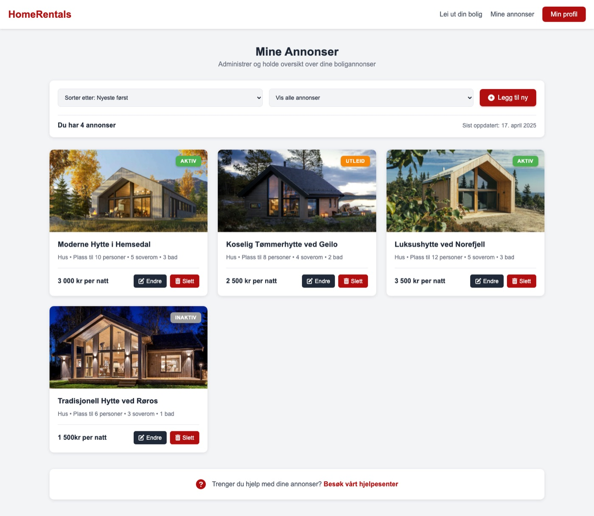
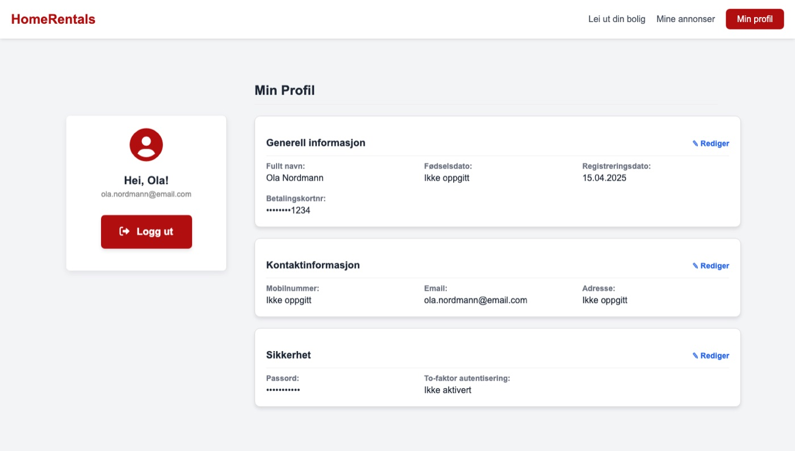

# HomeRentals 🏡

HomeRentals is a website for renting cabins and holiday homes in Norway. We made it in the course SYS1000 in spring 2025 (Feb to May), and it was the **first project we ever did together as a group**.

At that point most of us had just started learning HTML and CSS, so this project is really us learning the basics: how to build a layout, style forms, make a navbar, link pages together and work in the same Git repo without breaking each other's stuff. It's a school project and a pretty early one, so please don't judge the code too hard 😅

Everything is plain HTML and CSS (plus a tiny bit of JavaScript). There is no backend, so the forms, login and payment don't actually do anything. It's a clickable prototype of how the site would look and work.

**Try it here:** https://nebedolagaa.github.io/SYS1000-GRUPPE12/



## Screenshots

### Search
Search for a place and dates, filter and sort the results.



### Cabin page
Pictures, description, facilities, price and date picker.



### Booking
Booking is split into steps. First your contact info, then payment, with a summary of the stay on the right.





### Rent out your home
A three-step form for hosts who want to list their cabin.



### My listings
When you're logged in as a host you can see, edit and delete your listings.



### Profile



The user in the screenshots is made up.

## What's in the project

- Home page with search and featured cabins
- Search page with filters, and a page for each cabin
- Booking and payment flow in several steps
- Register, log in and forgot password pages
- "Rent out your home" form and a page for managing your listings
- Profile page where you can edit your info
- Info pages: about us, blog, career, help center, privacy, terms, cookies

## How to open it

The easiest way is the live version on [GitHub Pages](https://nebedolagaa.github.io/SYS1000-GRUPPE12/). To run it locally, no installation is needed. Clone the repo and open the home page in your browser:

```bash
git clone https://github.com/nebedolagaa/SYS1000-GRUPPE12.git
cd SYS1000-GRUPPE12/Prosjekt/Hoved
open hjemmeside.html        # or just double-click the file
```

## Project structure

```text
Prosjekt/
├── Hoved/    the site as a visitor sees it (not logged in)
└── Profil/   the same site when you're logged in (profile, my listings, edit listing)
```

Each folder has its own HTML pages, `styles.css`, images (`Bilder/`) and favicons. We didn't know about templates or components yet, so the navbar and footer are copied into every page. That's one of the things we'd do very differently now.

## What we learned

- The basics of HTML and CSS: layouts with flexbox and grid, forms, cards, navbars
- Splitting a website into pages and linking them together
- Working in the same Git repo as a team for the first time (and merging each other's changes for the first time)
- That copying the same code into 60 files is a bad idea when you need to change the navbar 🙃

A year later we built a much bigger project together, [TicketHub](https://github.com/nebedolagaa/tickethub-portfolio), a full ticketing site in Django with a database, user accounts and a REST API.

## The team

- Nikita ([@nebedolagaa](https://github.com/nebedolagaa))
- Christoffer ([@Christofferberg77](https://github.com/Christofferberg77))
- Kamilla ([@kamazik0102](https://github.com/kamazik0102))
- Jesper ([@jesper0202](https://github.com/jesper0202))
- Magnus ([@Magnusbot1](https://github.com/Magnusbot1))
- Eskild ([@EskSond](https://github.com/EskSond))
